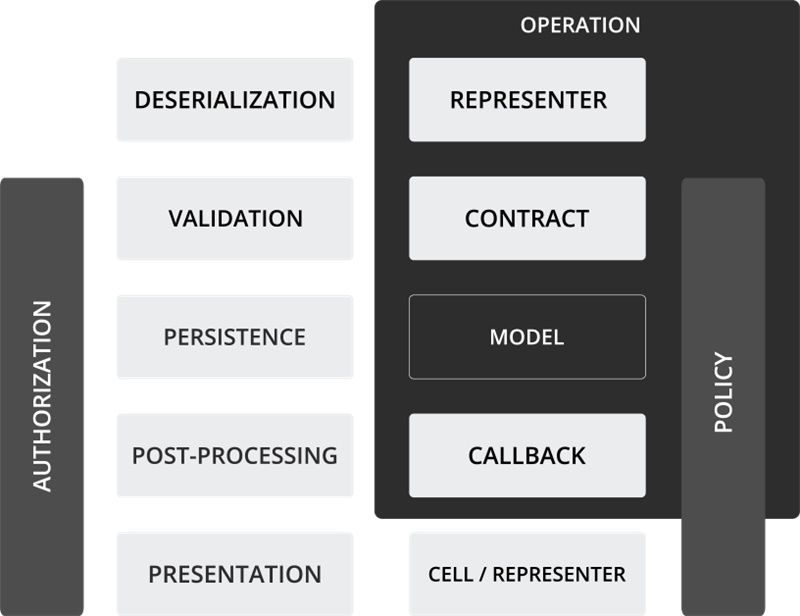

# Trailblazer

Porozumění základním prvkům Trailblazeru a jeho architektuře na vysoké úrovni nezabere více než 20 minut. Jakmile opustíte myšlení „MVC“ a necháte Trailblazer ukázat, jak restrukturalizuje aplikace, definuje silné konvence, kde by měl být kód umístěn, a jak objekty interagují, stane se pro vás jen dalším nástrojem ve vašem repertoáru.
Upozorňujeme, že tato příručka popisuje pouze operaci Vytvořit. Popisované koncepty se vztahují na všechny druhy funkcí, jako je aktualizace nebo mazání.
Doufáme, že se vám bude líbit!

---

## Architektura na vysoké úrovni
Trailblazer, který se prezentuje jako architektura na vysoké úrovni, si klade za cíl pomáhat softwarovým týmům implementovat skutečnou obchodní logiku jejich aplikací. Obchodní logiku chápeme jako vše, co se děje po zachycení HTTP požadavku a před vrácením odpovědi.

Trailblazer ponechává zpracování HTTP a pokyny pro vykreslování na infrastruktuře frameworku: Může to být jakákoli knihovna, kterou máte rádi, Rails, Hanami, Sinatra nebo Roda.

Obchodní kód je zapouzdřen do operací, které jsou základním a klíčovým prvkem Trailblazeru. Operace vás jemně nutí oddělit kód aplikace od frameworku. Proto by se váš kód v ideálním případě neměl starat o podkladový framework.

---

## Tok
Ve webovém prostředí jsou akce uživatelů zpracovávány prostřednictvím požadavků. Každý typický obchodní pracovní tok v požadavku je strukturován do pěti kroků.

Podívejte se na levou stranu diagramu. Toto je to, co musí každý požadavek zpracovat.



- Deserializace
- Validace
- Trvalost
- Následné zpracování, tzv. zpětná volání
- Prezentace, vykreslení odpovědi

Na pravé straně můžete vidět, jak Trailblazer zavádí nové zajímavé abstrakční vrstvy. **Vrstvy jsou implementovány jako objekty.** Každý objekt zpracovává pouze jeden konkrétní aspekt, čímž se minimalizuje odpovědnost každé vrstvy.

Vertikální autorizační vrstva umožňuje zapojit zásady do každého bodu vašeho kódu.

Tento přístup povede k tomu, že řadiče budou prázdnými koncovými body HTTP, štíhlými modely s rozsahy relevantními pro perzistenci, vyhledávači a asociacemi a pouze několika novými inovativními objekty, které vám pomohou implementovat podnikání.

---

## Funkce aplikace
Každá aplikace je souborem funkcí (nebo „funkcí“), které může uživatel spustit. Může se jednat o zobrazení komentáře, aktualizaci údajů o uživateli, sledování obchodu s točeným pivem nebo import CSV souboru mlýnků na kávu do databáze.

Každá funkce je implementována jednou veřejnou operací. Operace jsou objekty. To znamená, že pro každou funkci vaší aplikace napíšete třídu operace, která se pak připojí k koncovému bodu frameworku.

Skvělé na tom je, že můžete také postupně zavádět operace do stávajících systémů a nahrazovat starý kód nebo přidávat nové funkce pomocí operací a buněk.

---

## Řadič (Controller)
Každý webový framework má koncept řadičů: koncové body připojené k HTTP trase. Může se například jednat o akci řadiče Rails vyvolanou prostřednictvím požadavku POST `/comments`.

Kód, který byste obvykle vložili do metody zachycující akci, jako je vytvoření objektu, přiřazení parametrů požadavku k němu atd., tam již není.

Místo toho koncový bod jednoduše odesílá svou operaci.

```ruby
class CommentsController < ApplicationController
  def create
    Comment::Create.(params)
    # stále se musíte postarat o vykreslení.
  end
```

Trailblazer využívá jmenné prostory Ruby tak, jak byly zamýšleny. Proto je konstantní název operace `Comment::Create`.

Každá operace má pouze jednu odpovědnost a vystavuje pouze jednu veřejnou metodu: `call`. Ruby automaticky vyvolá metodu `call`, když je název metody vynechán, což poskytuje praktický zkrácený styl: `Create.(params)` namísto `Create.call(params)`.

Možná jste si všimli, že nedochází k instanciování operace. To se děje interně. Zveřejnění pouze jedné veřejné metody je koncept převzatý z funkcionálního programování: protože existuje pouze jeden způsob vyvolání operace, nemůžete zaměnit pořadí metod ani narušit interní stav.

To, co předáváte do operace, je zcela na vás (bez dvojznačnosti). Ve webových aplikacích to bude obvykle hash `params`. Všimněte si, že tímto způsobem se operace zcela **odděluje od HTTP**. Můžete ji použít také v úloze na pozadí nebo v systému smyčky událostí – operace očekává jako vstup hash, nic víc.

---

## Operace (Operation)

Operace `Comment::Create` je třída, která se stará o celý proces vytváření, ověřování a uchovávání komentářů.

Nezaměňujte ji však s božskou třídou. Operace je koordinační objekt, který dává pokyny menším objektům, jako jsou reprezentanty, formulářový objekt nebo trvalý model, aby toho dosáhly! Ví, jak propojit tyto zúčastněné strany, ale konkrétní implementaci nechává na nich.

```ruby
class Comment < ActiveRecord::Base
  class Create < Trailblazer::Operation
    model Comment, :create

    contract do
      property :body
      property :author_id

      validates :body, presence: true
    end

    def process(params)
      validate(params[:comment]) do
        contract.save
      end
    end
  end
end
```

Operace jsou vždy zařazeny do jmenného prostoru podle svého konceptu. V Rails se velmi často jedná o konstantní název modelu. Třída `Create` se nachází v konstantě ActiveRecord `Comment`. Jedná se o jednoduché jmenné prostory Ruby, které by se v žádném případě neměly zaměňovat s dědičností.

Každá operace musí implementovat metodu `process`. Zde dochází k provedení obchodního kódu a k orchestraci.

Třída `Operation` nabízí metodu `validate` pro deserializaci a ověření příchozích dat. K tomu operace používá svůj formulářový objekt, známý také jako contract (smlouva) v Trailblazeru.

---

## Smlouva (Contract)
Jelikož je velmi běžné, že operace používají smlouvu pro ověření, můžete smlouvy definovat inline pomocí deklarativní metody třídy `contract`.

```ruby
class Create < Trailblazer::Operation
  # ..
  contract do
    property :body
    property :author_id

    validates :body, presence: true
  end
```

Smlouva je jednoduše [třída Reform](https://trailblazer.to/2.0/gems/reform). **Umožňuje specifikovat pole vstupu a validace specifické pro danou operaci.**

V Trailblazeru je velmi důležité explicitně deklarovat příchozí pole. Při ověřování vstupu bude smlouva respektovat pouze definovaná pole nebo pole na whitelistu a ignorovat nevyžádaná data ve vstupu. Proto již nepotřebujete řešení jako `strong_parameters`.

Ověření lze definovat pomocí [ActiveModel::Validations](https://guides.rubyonrails.org/active_record_validations.html) nebo nového enginu [dry-validation](reform-cs.md#dry-validation).

---

## Ověření (Validation)
K ověření příchozích parametrů `params` se používá metoda `validate` v operaci.

```ruby
class Create < Trailblazer::Operation
  # ..
  def process(params)
    validate(params[:comment]) do
      # ..
    end
  end
```
V případě úspěšné validace se vyvolá blok předaný metodě `validate`.

Metoda `validate` operace nejprve instancuje smlouvu, která je ve skutečnosti pouze objektem Reform. Poté se příchozí data zapíší do objektu smlouvy (tento proces se nazývá *deserializace*) a následně se pomocí API Reform provede validace celého objektového grafu.

Celý proces validace probíhá interně, ale lze jej snadno přizpůsobit. Důležitým faktem je, že smlouva je mezilehlý objekt – **namísto zápisu vstupu do modelu se vše odehrává ve smlouvě.** Model není pro validaci vůbec přístupný.

Díky tomu, že mezi operací a modelem je umístěn specializovaný objekt smlouvy, budou vaše modelové třídy nakonec čistou vrstvou perzistence.

```ruby
class Comment < ActiveRecord::Base
  belongs_to :author
end
```

Kód validace se nachází ve smlouvě, zpětná volání jsou definována v objektech operace nebo zpětného volání.

---

## Trvalost (Persistence)
Po ověření dat je k jejich trvalému uložení zapotřebí modelový objekt. Ve většině aplikací Rails se jedná o model `ActiveRecord`, ale mnoho projektů Trailblazer používá alternativní knihovny, jako jsou [Sequel](https://sequel.jeremyevans.net/) nebo [ROM](https://rom-rb.org/).

Modely si můžete vytvářet nebo načítat sami. Operace vám však nabízí jednoduché API pro vytvoření modelu, když je to potřeba.

```ruby
class Create < Trailblazer::Operation
  model Comment, :create # přiřadí @model = Comment.new
```

Po ověření dat v objektu smlouvy je dobré data přenést do modelu a uložit. To se opět provádí pomocí API smlouvy.

```ruby
class Create < Trailblazer::Operation
  # ..
  def process(params)
    validate(params[:comment]) do
      contract.save
    end
  end
```

**Model je nyní naplněn ověřenými daty a uložen do databáze.** V pozadí probíhá velmi jednoduchý mechanismus, který lze snadno změnit, pokud nesouhlasíte s postupem Trailblazeru.

---

## Zpětné volání (Callback)
Často je po trvalém uložení nutné provést další logiku. V Trailblazeru se tomu říká *post-processing* nebo *callbacks*. Namísto znečišťování modelu nebo kontroléru tímto kódem **jsou zpětná volání součástí operace.**

Jsou doslova volána, když je potřebujete.

```ruby
class Create < Trailblazer::Operation
  # ..
  def process(params)
    validate(params[:comment]) do
      contract.save

      after_save!
    end
  end

private
  def after_save!
    CommentNotifier.daily_digest(model).deliver_later
  end
```

Callbacky mohou být metodami operace, samostatnými callbackovými objekty, používajícími callbackové API Trailblazeru, nebo dokonce pokročilými transakčními gemy, jako je vynikající [dry-transaction](https://github.com/dry-rb/dry-transaction).

---

## Testování
Trailblazer a jeho návrh operací výrazně zjednodušují testování chování vaší aplikace. **Veškerý obchodní kód je testován pomocí operačních testů.**

```ruby
describe Comment::Create do
  it „persists valid input“ do
    op = Comment::Create.(comment: { body: „TRB rocks!“, author_id: 1 })

    op.model.persisted?.must_equal true
    op.model.body.must_equal „TRB rocks!“
  end
end
```

Operace se také používají jako továrny v aplikacích Trailblazer. Tím se zajistí, že stav vaší testovací aplikace bude vždy identický s reálným stavem produkce.

```ruby
let(:user)    { User::Create.(user: attributes_for(:user)).model }
let(:comment) { Comment::Create.(comment: { body: „Yo!“, author_id: user.id} ) }
```

Doba netěsných továren je pryč. Gemy jako [factory_bot](https://github.com/thoughtbot/factory_bot) lze použít pouze k poskytování vstupních hashů.

Trailblazer také opouští testy řadičů ve prospěch přísných integračních testů. Tím se testování minimalizuje na integrační a operační testy.

---

## Struktura souborů
Soubory pro další abstrakční vrstvy již nejsou organizovány podle technologie. Trailblazer zavádí pojem *koncepty*, které seskupují soubory podle sady funkcí.

```
app
├── concepts
│   ├── comment
│   │   ├── contract
│   │   │   ├── create.rb
│   │   │   └── update.rb
│   │   ├── cell
│   │   │   └── new.rb
│   │   ├── operation
│   │   │   ├── create.rb
│   │   │   └── update.rb
│   │   └── view
│   │       ├── new.haml
│   │       └── show.haml
```

Konceptem mohou být komentáře, blogové příspěvky, galerie obrázků nebo abstraktní pracovní postupy. Operace zároveň nejsou omezeny na CRUD. Často se nazývají `Job::Apply` nebo `User::Follow` a pomáhají s doménově orientovaným návrhem softwaru.

---

## Zobrazení UI (View)
Zatímco operace je klíčovým prvkem pro zpracování obchodních procesů, Trailblazer také přichází s náhradou za zobrazení. To je zcela volitelné a můžete použít zobrazení svého frameworku, jako je například `ActionView`.

Objektově orientované *modely zobrazení* jsou poskytovány gemem [Cells](https://trailblazer.to/2.0/gems/cells). Zahrnují fragmenty webového uživatelského rozhraní a usnadňují řešení složitých situací.

Tyto *buňky* se obvykle vykreslují z řadiče.

```ruby
class CommentsController < ApplicationController
  def show
    comment = Comment::Create.present(params)

    render Comment::Cell::New, comment, layout: Application::Layout
  end
```

Modely zobrazení nebo buňky jsou třídy.

```ruby
module Comment::Cell
  class New < Trailblazer::Cell
    property :body

    def author_name
      model.author.full_name || „Anonymous“
    end
  end
end
```

Pomocné funkce známé z Rails již neexistují. Místo nich lze v zobrazení použít instancové metody buňky.

```ruby
%h1 Comment

.row
  = body
.row
  = author_name
```

Opět platí, že modely zobrazení v Trailblazeru jsou poskytovány gemem [Cells gem](https://trailblazer.to/2.0/gems/cells), který je zcela oddělen od Trailblazeru. Funguje také v jiných frameworkách, jako jsou Hanami nebo Sinatra.

---

## Zásady (Policy)
Trailblazer klade na autorizaci velký důraz. Operace definují objekty zásad, ke kterým lze přistupovat a dotazovat se na ně v celém stacku za účelem rozhodování o řízení přístupu.

Nejjednodušší formou je *zásada ochrany*, kterou můžete přímo vložit do operace.

```ruby
class Create < Trailblazer::Operation
  policy do |params|
    params[:current_user].present?
  end
```

Zásady budou vyhodnoceny při instanciování operace a **umožňují odmítnout provedení kódu pro konkrétní prostředí**, navíc je lze kdykoli později znovu použít. To zahrnuje dotazy ve vrstvě zobrazení.

Navíc nejsou omezeny na bloky. Trailblazer umožňuje také [zásady ve stylu Pundit](https://trailblazer.to/2.0/gems/operation/2.0/policy).

---

## Reprezentátor (Representer)
Operace jsouice velmi užitečné pro zpracování odeslaných formulářů, ale lze je použít stejným způsobem i pro dokumentové API, např. s JSON nebo XML. Funguje to tak, že **reprezentátory analyzují vstup a vykreslují dokument s odpovědí.**

Reprezentátory lze definovat přímo v operaci.

```ruby
class Create < Trailblazer::Operation
  representer do
    include Roar::JSON
    include Roar::Hypermedia

    property :id
    property :body
    property :author_id

    link(:self) { comment_path(represented.id) }
  end
```

Operace nyní rozpozná, že vstupní a výstupní dokument již není hash, ale dokument JSON. Použije reprezentátora k analýze příchozího dokumentu a poskytne metodu `to_json` pro renderování odpovědi kontrolérem.

```ruby
Comment::Create.(‚{„body“: „Solnic rules!“}‘).to_json
#=> ‚{„body“: „Solnic rules!“, „id“:1, link: {„rel“:„self“, ‚href‘:„/comments/1“}}‘
```

Reprezentanty v Trailblazeru jsou poskytovány gemem [Roar](https://trailblazer.to/2.0/gems/roar) a jsou zcela volitelné.

---

## Instalace
Použití Trailblazeru spočívá v instalaci několika gemů, které vám pomohou aplikovat styl na vaši aplikaci.

```yaml
gem „trailblazer“
```

Obvykle stačí k zahájení práce gem `trailblazer` nebo gem `trailblazer-rails` v prostředí Rails. Jelikož je však Trailblazer velmi modulární, je možné mnoho kombinací, proto si nezapomeňte přečíst také [instalační příručku](https://trailblazer.to/2.0/guides/getting-started).

---

## O čem jsme nemluvili
Trailblazer má mnoho dalších funkcí, které vám pomohou psát lepší software.

Pokud se vám nelíbí smlouvy, zásady nebo zástupci v řádku, můžete operaci nařídit, aby použila také externí třídu. To umožňuje kompozitní rozhraní.

Můžete také využít operace v požadavcích pouze pro vykreslení a použít objekt smlouvy s pomocníkem pro vykreslení formuláře.

Polymorfní rozhraní Trailblazer umožňuje čistě zpracovávat okrajové případy v malých podtřídách, aniž byste museli v kódu používat `ifs` a `else`.

A každý den přibývají další optimalizace. Rádi pracujeme na Trailblazeru a zjednodušujeme život programátorům.