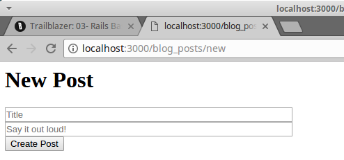
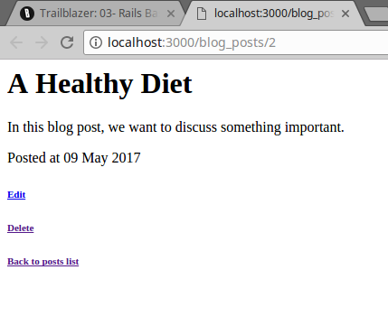

# 03- Základy Rails

Nyní, když jsme se naučili, co operace dělají a jak Trailblazer poskytuje pohodlné makro kroky, které usnadňují život softwarovým inženýrům, je čas podívat se, jak používat operace, smlouvy a buňky v Rails.

 Kde je [PŘÍKLAD KÓDU?](https://github.com/trailblazer/guides/tree/operation-03) ([Offline](guides-operation-03.zip))

## Nastavení
V tomto příkladu použijeme operace Trailblazer s objekty formuláře Reform k ověření a zpracování příchozích dat.

Zde je soubor `Gemfile`.

```
source "https://rubygems.org"

gem "rails", "~> 5.1"
gem "activerecord"
gem "sqlite3"

gem "simple_form"
# gem "formular", github: "trailblazer/formular"
gem "dry-validation"

gem "trailblazer", ">= 2.0.3"
gem "trailblazer-rails"
gem "trailblazer-cells"
gem "cells-rails"
gem "cells-slim"


group :test do
  gem "rspec-rails"
  gem "capybara"
end
```

Gem `trailblazer-rails` dělá integraci hračkou. Automaticky stáhne a spustí gem `trailblazer-loader` [gem](https://trailblazer.to/2.0/gems/trailblazer/loader) za vás pomocí Railtie [https://github.com/trailblazer/trailblazer-rails/blob/master/lib/trailblazer/rails/railtie.rb]. Všechny soubory Trailblazer jsou načítány předem.

V Trailblazer nevěříme, že neustále se měnící runtime prostředí je dobrý nápad. Kód, který je možná načítán v určitém pořadí, může být zdrojem mnoha problémů ve výrobě. I v režimu vývoje chceme prostředí co nejblíže výrobě.

Proto `trailblazer-loader` vždy načte všechny soubory TRB při spuštění serveru. Zpomalení je asi 2 sekundy a je zanedbatelné, protože automatické načítání s Rails stále funguje.

Gem `traiblazer-rails` také přidává jednu jedinou metodu `#run` do `ApplicationController`, kterou brzy objevíme.

## Struktura souborů

Aplikaci Trailblazer v Rails můžete vždy najít v adresáři `app/concepts`.

```
├── app
│   ├── concepts
│   │   ├── blog_post
│   │   │   ├── cell
│   │   │   │   ├── edit.rb
│   │   │   │   ├── index.rb
│   │   │   │   ├── item.rb
│   │   │   │   ├── new.rb
│   │   │   │   └── show.rb
│   │   │   ├── contract
│   │   │   │   ├── create.rb
│   │   │   │   └── edit.rb
│   │   │   ├── operation
│   │   │   │   ├── create.rb
│   │   │   │   ├── delete.rb
│   │   │   │   ├── index.rb
│   │   │   │   ├── show.rb
│   │   │   │   └── update.rb
│   │   │   └── view
│   │   │       ├── edit.slim
│   │   │       ├── index.slim
│   │   │       ├── item.slim
│   │   │       ├── new.slim
│   │   │       └── show.slim
│   │   └── user
│   │       ├── contract
│   │       │   └── create.rb
│   │       └── operation
│   │           └── create.rb
│   ├── controllers
│   │   ├── application_controller.rb
│   │   └── blog_posts_controller.rb
│   └── models
│       ├── blog_post.rb
│       └── user.rb
```

Zde jsou soubory strukturovány podle konceptu a poté podle technologie. To, co se velmi liší od Rails, se ukázalo jako velmi intuitivní a zdůrazňuje modularitu, kterou TRB přináší.

Například všechny třídy a pohledy související s konceptem „blogový příspěvek“ se nacházejí v `app/concepts/blog_post`. Různé abstrakce jsou reprezentovány vlastními adresáři, jako například `blog_post/operation` nebo `blog_post/contract`.

Mějte na paměti, že je také možné použít vnořené koncepty, jako v `app/concepts/admin/ui/post`.

V Trailblazeru jsme se také rozhodli, že **všechny názvy souborů a tříd jsou v jednotném čísle**, což znamená, že nemusíte přemýšlet o tom, zda by něco mělo být v množném čísle (stále je možné používat názvy v množném čísle, např. `app/concepts/invoices/..`).

Vaše řadiče (Controllers) a modely jsou, pokud není požadováno jinak, stále organizovány podle Rails Way, což umožňuje použití TRB v existujících projektech pro refaktoring.

## Prezentační operace
Jelikož jsme již v kapitole 02 probrali základní mechanismy, můžeme přejít přímo k prvnímu problému: jak vykreslit formulář pro vytvoření blogového příspěvku?

Nejprve potřebujeme prezentační operaci, která pro nás vytvoří prázdný `BlogPost` a nastaví objekt Reform, který pak lze vykreslit v zobrazení. Tato operace se podle konvence nazývá `BlogPost::Create::Present` a nachází se v `app/concepts/blog_post/operation/create.rb`.

```ruby
class BlogPost::Create < Trailblazer::Operation
  class Present < Trailblazer::Operation
    step Model(BlogPost, :new)
    step Contract::Build( constant: BlogPost::Contract::Create )
  end

  # ...
end
```

To jsou všechny kroky, které jsme probírali v kapitole 02. Vytvořte nový model a pomocí `Contract::Build` instancujte formulář Reform, který model zdobí.

Je zcela na vás, zda chcete mít samostatný soubor pro operace `Present`, nebo zda je chcete pojmenovat `New` a `Edit`. Zde uvedená konvence se používá ve stovkách aplikací a v posledních letech se vyvinula jako osvědčená praxe.

## Smlouva

Zajímavou částí současné operace je `:constant option:`, která odkazuje na třídu `BlogPost::Contract::Create`, která se nachází v souboru `app/concepts/blog_post/contract/create.rb`.

```ruby
require "reform"
require "reform/form/dry"

module BlogPost::Contract
  class Create < Reform::Form
    include Dry

    property :title
    property :body

    validation do
      required(:title).filled
      required(:body).maybe(min_size?: 9)
    end
  end
end
```

Smlouvy mohou být čistě schémata `dry-validation` nebo objekty Reform, které mohou zase používat `dry-validation` nebo `ActiveModel::Validations` jako svůj validační engine. Použití objektu Reform v každém případě umožní vykreslení tohoto formuláře v zobrazení.

## Renderování smlouvy (Contract Rendering)

Nyní máme připravený formulář a funkci a jsme připraveni je propojit s akcí `new` v `BlogPostsController`.

```ruby
class BlogPostsController < ApplicationController
  def new
    run BlogPost::Create::Present
    render cell(BlogPost::Cell::New, @form), layout: false
  end
```

Metoda `run` vyvolá operaci, volitelně předá závislosti, jako je `current_user`, do `call` operace a poté nastaví některé výchozí proměnné, jako jsou `@model` a `@form`.

Instance proměnné v kontroléru jsou nastaveny pouze pro vaše pohodlí a lze je také načíst prostřednictvím výsledného objektu. [→ API](https://trailblazer.to/2.0/gems/trailblazer/2.0/rails#run)

Po spuštění operace a načtení instance smlouvy je nyní čas vykreslit pohled s formulářem, který můžeme skutečně vyplnit a publikovat náš blogový příspěvek. To se děje pomocí `render` a vyvoláním buňky. Úkolem buňky je vykreslit formulář, takže jí musíme předat objekt `@form`.

Mimochodem, gem Cells a vykreslovací vrstva, kterou přináší, jsou zcela volitelné. Pokud chcete, můžete i nadále používat vykreslování ActionView spolu s operacemi.

---

## Buňka (Form Cell)

Buňka `BlogPost::Cell::New` je zodpovědná za vykreslení tohoto zobrazení. Její vnitřní strukturu probereme později, ale pro rychlý náhled zde uvádíme třídu buňky.

```ruby
module BlogPost::Cell
  class New < Trailblazer::Cell
    include ActionView::RecordIdentifier
    include ActionView::Helpers::FormOptionsHelper
    include SimpleForm::ActionViewExtensions::FormHelper
  end
end
```

`includes` jsou nezbytné pro import všech pomocníků, které potřebujeme v zobrazení.

První řádek `module BlogPost::Cell` je klíčový, protože vytváří modulovou konstantu `Cell` v jmenném prostoru `BlogPost`. Musí být v jednom řádku, jinak se vám budou zobrazovat podivné chyby konstant kvůli nikdy neopravené chybě v Ruby.

Jelikož vše, co děláme, je vykreslování pohledu, zatím neexistuje žádný skutečný kód. Když už mluvíme o pohledech, zde je pohled buňky v `app/concepts/blog_post/view/new.slim`.

```
.row.new
  h1 New Post

  = simple_form_for model do |f|
    .row
      .col-sm-12
        = f.input :title, placeholder: "Title", label: false
    .row
      .col-sm-12
        = f.input :body, placeholder: "Say it out loud!", label: false
    .row
      .col-sm-12
        = f.submit 'Create Post'
```

Dostatek kódu pro vykreslení formuláře blogu. Bez jakéhokoli rozvržení to vypadá trochu smutně, ale k tomu se dostaneme za chvíli.



Odesláním tohoto formuláře se odešle POST na `/blog_posts/`, což je další akce kontroléru, kterou musíme implementovat.

---

## Zpracování formuláře

Opět spustíme operaci. Tentokrát je to `BlogPost::Create`.

Vidíte, jak se akce kontroléru mapují na operace? Je to proto, že v aplikacích Rails odpovídají akce konkrétním funkcím aplikace („vytvořit příspěvek do blogu“, „vyhledat uživatele“, „přidat komentář“) a protože **obchodní logika by měla být zapouzdřena v operacích**, vždy najdete akce kontroléru, které jednoduše odesílají jednu operaci.

To však neznamená, že byste nemohli operace používat pro všechny druhy menších úkolů, v pozadí nebo jako příkazy konzole.

Zde je akce kontroléru, která odesílá operaci.

```ruby
def create
  run BlogPost::Create do |result|
    return redirect_to blog_posts_path
  end

  render cell(BlogPost::Cell::New, @form), layout: false
end
```

Příjemným detailem funkce `run` je, že po úspěšném provedení operace spustí volitelný blok. To znamená, že v případě úspěšného vytvoření blogového příspěvku můžeme přesměrovat na indexovou stránku. V opačném případě znovu vykreslíme buňku formuláře.

Vezměte prosím na vědomí, že v bloku je příkaz `return`, který zastaví provádění kontroléru. Pokud na to zapomenete, bude proveden i zbytek metody `create`.

Podívejme se nyní podrobně na operaci `BlogPost::Create`.

---

## Create

While the operation we implemented earlier only creates an unpersisted model, the `BlogPost::Create` operation also processes the submitted form data and physically persists the model in case of validity.

To understand how the operation knows whether or not it was run successful, and how this entire workflow is implemented, we should have a look at the code in `app/concepts/blog_post/operation/create.rb`.

```ruby
class BlogPost::Create < Trailblazer::Operation
  class Present < Trailblazer::Operation
    step Model(BlogPost, :new)
    step Contract::Build( constant: BlogPost::Contract::Create )
  end

  step Nested( Present )
  step Contract::Validate( key: :blog_post )
  step Contract::Persist( )
  step :notify!

  def notify!(options, model:, **)
    options["result.notify"] = Rails.logger.info("New blog post #{model.title}.")
  end
end
```

Don’t get confused by the nested `Present` class in `Create`! This is only Ruby’s way of namespacing and doesn’t leak any logic or state into the `Create` operation.

The `Create` operation definition starts with the `step Nested ( .. )` statement. This is where we’re reusing the existing `Present` operation to create the model and contract for it. After that’s done, we run validations, persist the data to the model (in case the validation is happy) and send a notification after it.

[The](https://trailblazer.to/2.0/gems/operation/2.0/api#nested) `Nested` [step macro](https://trailblazer.to/2.0/gems/operation/2.0/api#nested) runs the Present operation and copies the key/value pairs from its result object into Create our result object. Of course, this all happens at run-time.

We wrote enough code to have a fully working setup to create, validate and persist blog posts along with post-processing logic such as sending out notifications, which would usually happen in an ActiveRecord callback.

While an invalid form submission will re-render the form, sane data causes us to get redirect to `/blog_posts/`, aka the index action.

---

## Index

The controller `index` method, again, simply dispatches to the `BlogPost::Index` operation and then uses its cell to render the list.

```ruby
def index
  run BlogPost::Index
  render cell(BlogPost::Cell::Index, result["model"]), layout: false
end
```

We’re going to discuss the cell in another chapter. Here’s the operation found in `app/concepts/blog_post/operation/index.rb`.

```ruby
class BlogPost::Index < Trailblazer::Operation
  step :model!

  def model!(options, *)
    options["model"] = ::BlogPost.all.reverse_order
  end
end
```

In line with what we did in `Create::Present`, the Index operation’s job is to retrieve a list of posts and expose them via the result object’s `"model"` field.

Remember that this is the place where pagination, filtering, or even delegating to `Query` objects might happen. So far, we didn’t see the need to introduce framework-based query objects, but with increasing usage this might be an optional feature in a future version.

Also, the name `"model"` - despite it being an array - is purely conventional.

This array is then passed into the cell and renders an index list. In that list, clicking a link will direct you to a URL such as `/blog_posts/1`, which corresponds to a `show` action.

---

## Show

The `show` action in the controller now doesn’t look anything special, anymore.

```ruby
def show
  run BlogPost::Show
  render cell(BlogPost::Cell::Show, result["model"]), layout: false
end
```

Given that we’ve just learned about the `Index` operation, the `Show` class in `app/concepts/blog_post/operation/index.rb` is almost boring.

```ruby
class BlogPost::Show < Trailblazer::Operation
  step Model(BlogPost, :find_by)
end
```

Trailblazer already ships with the `Model` macro to retrieve the model and assign it to the `options` object.

We use `find_by`, which will either return the model matching the `:id` field, or `nil`. This has the advantage that there won’t be an evil exception breaking our flow, but the operation will automatically jump to the error track if it can’t find a model.

A colorless, but functional view of a particular blog post is the reward for our hard work.




Admittedly, this looks quite bare-bones, but we can read the blog post, and have links to edit and delete it.

When clicking *Edit* we will be redirect to `/blog_posts/1/edit`. This is just another controller action dispatching to the `BlogPost::Update::Present` operation.

## Edit

When editing an existing blog post, the `BlogPostsController#edit` action is invoked.

```ruby
def edit
  run BlogPost::Update::Present
  render cell(BlogPost::Cell::Edit, @form), layout: false
end
```

The processing part of the update flow is implemented via the `#update` action.

```ruby
def update
  run BlogPost::Update do |result|
    flash[:notice] = "#{result["model"].title} has been saved"
    return redirect_to blog_post_path(result["model"].id)
  end

  render cell(BlogPost::Cell::Edit, @form), layout: false
end
```

Again, the cells views will be discussed in chapter 05. Let’s focus on the business logic here.

## Update

The following code file are the `BlogPost::Update::Present` and `BlogPost::Update` operations used in the two controller actions just introduced. Just as their Create counterpart, we put them in `app/concepts/blog_post/update.rb`.

```ruby
class BlogPost::Update < Trailblazer::Operation
  class Present < Trailblazer::Operation
    step Model(BlogPost, :find_by)
    step Contract::Build( constant: BlogPost::Contract::Create )
  end

  step Nested(Present)
  step Contract::Validate( key: :blog_post )
  step Contract::Persist()
end
```

Note that in the `Model` step, we use the `:find_by` method, just as we did for [Show](#show). Another interesting fact here’s that the `Create` contract is reused. At the moment, we don’t need differing validations for the editing logic, which allows us to lazily point to that existing class.

The last missing piece for our simple CRUD example is deleting: we want to be able to trash articles that no longer fit.

---

## Delete

The controller action `#destroy` is responsible for triggering the respective delete logic.

```ruby
def destroy
  run BlogPost::Delete

  flash[:alert] = "Post deleted"
  redirect_to blog_posts_path
end
```

Since we don’t have anything that could go wrong, yet, we don’t need the block for `run`. The operation in `app/concepts/blog_post/operation/delete.rb` is very simple, too.

```ruby
class BlogPost::Delete < Trailblazer::Operation
  step Model(BlogPost, :find_by)
  step :delete!

  def delete!(options, model:, **)
    model.destroy
  end
end
```

The `Model` macro helps with finding the right blog post instance, and a custom `delete!` step actually deletes the model using ActiveRecord’s `destroy` method.

---

## Summary
Building a simple CRUD component for a model is very easy with Trailblazer. In this chapter, we really only focused on the business code, and we will learn about Cells in chapter 05.

However, and this is a terrible thing to do, we’ve totally neglected testing! Testing with Trailblazer is incredibly simple and much more straight-forward as compared to Rails and its quite fragmented testing style. We’ll discover the world of testing in the next chapter, and only once we’re finished you can sit back and be proud of your work.

from [here](https://trailblazer.to/2.0/guides/trailblazer/2.0/03-rails-basics)