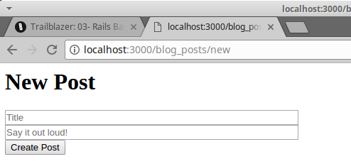
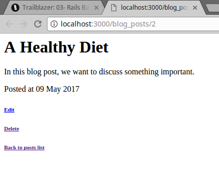

# 03- Rails Basics

Now that we’ve learned what operations do and how Trailblazer provides convenient macro steps to ease your life as a software engineer, it’s time to check out how to use operations, contracts, and cells in Rails.

 Where’s the [EXAMPLE CODE?](https://github.com/trailblazer/guides/tree/operation-03) ([Offline](guides-operation-03.zip))

## Setup
In this example we will use Trailblazer operations with Reform form objects to validate and process incoming data.

Here’s the `Gemfile`.

```
source "https://rubygems.org"

gem "rails", "~> 5.1"
gem "activerecord"
gem "sqlite3"

gem "simple_form"
# gem "formular", github: "trailblazer/formular"
gem "dry-validation"

gem "trailblazer", ">= 2.0.3"
gem "trailblazer-rails"
gem "trailblazer-cells"
gem "cells-rails"
gem "cells-slim"


group :test do
  gem "rspec-rails"
  gem "capybara"
end
```

The `trailblazer-rails` gem makes the integration a walk in the park. It pulls and invokes the `trailblazer-loader` [gem](https://trailblazer.to/2.0/gems/trailblazer/loader) automatically for [you via a Railtie](https://github.com/trailblazer/trailblazer-rails/blob/master/lib/trailblazer/rails/railtie.rb). All Trailblazer files are eager-loaded.

In Trailblazer, we don’t believe that an ever-changing runtime environment is a good idea. Code that is, maybe, loaded, in a certain order, maybe, is a source of many production problems. Even in development mode we want an environment as close to production as possible.

This is why `trailblazer-loader` always loads all TRB files at server startup. The speed decrease is about 2 seconds and is ignorable, since the automatic reloading with Rails still works.

The `traiblazer-rails` gem also adds one single method `#run` to the `ApplicationController` which we’ll discover soon.

## File Structure

You can always discover a Trailblazer application in Rails by the `app/concepts` directory.

```
├── app
│   ├── concepts
│   │   ├── blog_post
│   │   │   ├── cell
│   │   │   │   ├── edit.rb
│   │   │   │   ├── index.rb
│   │   │   │   ├── item.rb
│   │   │   │   ├── new.rb
│   │   │   │   └── show.rb
│   │   │   ├── contract
│   │   │   │   ├── create.rb
│   │   │   │   └── edit.rb
│   │   │   ├── operation
│   │   │   │   ├── create.rb
│   │   │   │   ├── delete.rb
│   │   │   │   ├── index.rb
│   │   │   │   ├── show.rb
│   │   │   │   └── update.rb
│   │   │   └── view
│   │   │       ├── edit.slim
│   │   │       ├── index.slim
│   │   │       ├── item.slim
│   │   │       ├── new.slim
│   │   │       └── show.slim
│   │   └── user
│   │       ├── contract
│   │       │   └── create.rb
│   │       └── operation
│   │           └── create.rb
│   ├── controllers
│   │   ├── application_controller.rb
│   │   └── blog_posts_controller.rb
│   └── models
│       ├── blog_post.rb
│       └── user.rb
```

This is where files are structured by concept, and then by technology. What is very different to Rails has proven to be highly intuitive and emphasizes the modularity TRB brings.

For example, all classes and views related to the “blog post” concept are located in `app/concepts/blog_post`. The different abstractions are represented with their own directories, such as `blog_post/operation` or `blog_post/contract`.

Keep in mind that it is also possible to use nested concepts as in `app/concepts/admin/ui/post`.

Also, in Trailblazer we decided that **all file and class names are singular** which means you don’t have to think about whether or not something should be plural (it is still possible to use plural names, e.g. `app/concepts/invoices/..`).

Your controllers and models, unless desired differently, are still organized the Rails Way, allowing TRB to be used in existing projects for refactoring.

## Presentation Operation
Since we already covered the essential mechanics in chapter 02, we can jump directly into the first problem: how do we render a form to create a blog post?

At first, we need a presentation operation that creates an empty `BlogPost` for us and sets up a Reform object which can then be rendered in a view. This operation per convention is named `BlogPost::Create::Present` and sits in `app/concepts/blog_post/operation/create.rb`.

```ruby
class BlogPost::Create < Trailblazer::Operation
  class Present < Trailblazer::Operation
    step Model(BlogPost, :new)
    step Contract::Build( constant: BlogPost::Contract::Create )
  end

  # ...
end
```

Those are all steps we’ve discussed in chapter 02. Create a new model, and use `Contract::Build` to instantiate a Reform form that decorates the model.

It’s totally up to you whether or not you want a separate file for `Present` operations, or if you want to name them `New` and `Edit`. The convention shown here is in use in hundreds of applications and has evolved as a best-practice over the last years.

## Contract
The interesting part in the Present operation is the :constant option: it references the BlogPost::Contract::Create class, which itself lives in app/concepts/blog_post/contract/create.rb.

```ruby
require "reform"
require "reform/form/dry"

module BlogPost::Contract
  class Create < Reform::Form
    include Dry

    property :title
    property :body

    validation do
      required(:title).filled
      required(:body).maybe(min_size?: 9)
    end
  end
end
```

Contracts can be pure `dry-validation` schemas or Reform objects that can in turn use `dry-validation` or `ActiveModel::Validations` as their validation engine. Using a Reform object, whatsoever, will allow rendering that form in a view.

## Contract Rendering

We now have the form and operation in place and are ready to hook that into the `BlogPostsController`’s `new` action.

```ruby
class BlogPostsController < ApplicationController
  def new
    run BlogPost::Create::Present
    render cell(BlogPost::Cell::New, @form), layout: false
  end
```

The `run` method invokes the operation, optionally passes dependencies such as the `current_user` into the operation’s `call`, and then sets some default variables such as `@model` and `@form` for you.

The instance variables in the controller are only set for your convenience and could be retrieved via the result object, too. [→ API](https://trailblazer.to/2.0/gems/trailblazer/2.0/rails#run)

After running the operation and retrieving the contract instance, it is now time to render a view with a form, that we can actually fill out and publish our blog post. This happens via `render` and by invoking a cell. The cell’s job is rendering the form, so we need to pass the `@form` object to it.

BTW, the Cells gem and the rendering layer it brings is completely optional. If you want, you can keep using ActionView rendering along with operations.

---

## Form Cell

The `BlogPost::Cell::New` cell is responsible for rendering this view. We will discuss its internals later, but for a quick preview, here’s the cell class.

```ruby
module BlogPost::Cell
  class New < Trailblazer::Cell
    include ActionView::RecordIdentifier
    include ActionView::Helpers::FormOptionsHelper
    include SimpleForm::ActionViewExtensions::FormHelper
  end
end
```

The `includes` are necessary to import all helpers we need in the view.

The first line `module BlogPost::Cell` is crucial as it creates the module constant `Cell` in the `BlogPost` namespace. It has to be in one single line, otherwise you will get strange constant errors due to a never-fixed bug in Ruby.

As all we do is rendering the view, there’s no real code yet. Speaking of views, here is the cell’s view in `app/concepts/blog_post/view/new.slim`.

```
.row.new
  h1 New Post

  = simple_form_for model do |f|
    .row
      .col-sm-12
        = f.input :title, placeholder: "Title", label: false
    .row
      .col-sm-12
        = f.input :body, placeholder: "Say it out loud!", label: false
    .row
      .col-sm-12
        = f.submit 'Create Post'
```

Enough code to render the blog form. It looks a bit sad without any layout, but we’ll come to that shortly.



Submitting this very form will POST it to `/blog_posts/`, which is the next controller action we have to implement.

---

## Form Processing

Again, we run an operation. This time it’s `BlogPost::Create`.

Can you see how controller actions map to operations? This is because in Rails apps, actions correspond to specific application functions (“create blog post”, “search user”, “add comment”), and since the **business logic should be encapsulated in operations**, you will always find controller actions simply dispatching to one operation.

However, this doesn’t mean you couldn’t use operations for all kinds of smaller tasks, or in background jobs, or as console commands, too.

Here’s the controller action dispatching the operation.

```ruby
def create
  run BlogPost::Create do |result|
    return redirect_to blog_posts_path
  end

  render cell(BlogPost::Cell::New, @form), layout: false
end
```

A nice detail about `run` is: it executes an optional block when the operation was run successfully. This means we can redirect to the index page in case of a successful blog post create. Otherwise, we re-render the form cell.

Please note that there’s a `return` in the block, causing the controller’s execution to stop. If you forget this, the rest of the `create` method will be executed, too.

Let’s check out the `BlogPost::Create` operation in detail, now.

---

## Create

While the operation we implemented earlier only creates an unpersisted model, the `BlogPost::Create` operation also processes the submitted form data and physically persists the model in case of validity.

To understand how the operation knows whether or not it was run successful, and how this entire workflow is implemented, we should have a look at the code in `app/concepts/blog_post/operation/create.rb`.

```ruby
class BlogPost::Create < Trailblazer::Operation
  class Present < Trailblazer::Operation
    step Model(BlogPost, :new)
    step Contract::Build( constant: BlogPost::Contract::Create )
  end

  step Nested( Present )
  step Contract::Validate( key: :blog_post )
  step Contract::Persist( )
  step :notify!

  def notify!(options, model:, **)
    options["result.notify"] = Rails.logger.info("New blog post #{model.title}.")
  end
end
```

Don’t get confused by the nested `Present` class in `Create`! This is only Ruby’s way of namespacing and doesn’t leak any logic or state into the `Create` operation.

The `Create` operation definition starts with the `step Nested ( .. )` statement. This is where we’re reusing the existing `Present` operation to create the model and contract for it. After that’s done, we run validations, persist the data to the model (in case the validation is happy) and send a notification after it.

[The](https://trailblazer.to/2.0/gems/operation/2.0/api#nested) `Nested` [step macro](https://trailblazer.to/2.0/gems/operation/2.0/api#nested) runs the Present operation and copies the key/value pairs from its result object into Create our result object. Of course, this all happens at run-time.

We wrote enough code to have a fully working setup to create, validate and persist blog posts along with post-processing logic such as sending out notifications, which would usually happen in an ActiveRecord callback.

While an invalid form submission will re-render the form, sane data causes us to get redirect to `/blog_posts/`, aka the index action.

---

## Index

The controller `index` method, again, simply dispatches to the `BlogPost::Index` operation and then uses its cell to render the list.

```ruby
def index
  run BlogPost::Index
  render cell(BlogPost::Cell::Index, result["model"]), layout: false
end
```

We’re going to discuss the cell in another chapter. Here’s the operation found in `app/concepts/blog_post/operation/index.rb`.

```ruby
class BlogPost::Index < Trailblazer::Operation
  step :model!

  def model!(options, *)
    options["model"] = ::BlogPost.all.reverse_order
  end
end
```

In line with what we did in `Create::Present`, the Index operation’s job is to retrieve a list of posts and expose them via the result object’s `"model"` field.

Remember that this is the place where pagination, filtering, or even delegating to `Query` objects might happen. So far, we didn’t see the need to introduce framework-based query objects, but with increasing usage this might be an optional feature in a future version.

Also, the name `"model"` - despite it being an array - is purely conventional.

This array is then passed into the cell and renders an index list. In that list, clicking a link will direct you to a URL such as `/blog_posts/1`, which corresponds to a `show` action.

## Show

The `show` action in the controller now doesn’t look anything special, anymore.

```ruby
def show
  run BlogPost::Show
  render cell(BlogPost::Cell::Show, result["model"]), layout: false
end
```

Given that we’ve just learned about the `Index` operation, the `Show` class in `app/concepts/blog_post/operation/index.rb` is almost boring.

```ruby
class BlogPost::Show < Trailblazer::Operation
  step Model(BlogPost, :find_by)
end
```

Trailblazer already ships with the `Model` macro to retrieve the model and assign it to the `options` object.

We use `find_by`, which will either return the model matching the `:id` field, or `nil`. This has the advantage that there won’t be an evil exception breaking our flow, but the operation will automatically jump to the error track if it can’t find a model.

A colorless, but functional view of a particular blog post is the reward for our hard work.




Admittedly, this looks quite bare-bones, but we can read the blog post, and have links to edit and delete it.

When clicking *Edit* we will be redirect to `/blog_posts/1/edit`. This is just another controller action dispatching to the `BlogPost::Update::Present` operation.

## Edit

When editing an existing blog post, the `BlogPostsController#edit` action is invoked.

```ruby
def edit
  run BlogPost::Update::Present
  render cell(BlogPost::Cell::Edit, @form), layout: false
end
```

The processing part of the update flow is implemented via the `#update` action.

```ruby
def update
  run BlogPost::Update do |result|
    flash[:notice] = "#{result["model"].title} has been saved"
    return redirect_to blog_post_path(result["model"].id)
  end

  render cell(BlogPost::Cell::Edit, @form), layout: false
end
```

Again, the cells views will be discussed in chapter 05. Let’s focus on the business logic here.

## Update

The following code file are the `BlogPost::Update::Present` and `BlogPost::Update` operations used in the two controller actions just introduced. Just as their Create counterpart, we put them in `app/concepts/blog_post/update.rb`.

```ruby
class BlogPost::Update < Trailblazer::Operation
  class Present < Trailblazer::Operation
    step Model(BlogPost, :find_by)
    step Contract::Build( constant: BlogPost::Contract::Create )
  end

  step Nested(Present)
  step Contract::Validate( key: :blog_post )
  step Contract::Persist()
end
```

Note that in the `Model` step, we use the `:find_by` method, just as we did for [Show](#show). Another interesting fact here’s that the `Create` contract is reused. At the moment, we don’t need differing validations for the editing logic, which allows us to lazily point to that existing class.

The last missing piece for our simple CRUD example is deleting: we want to be able to trash articles that no longer fit.

---

## Delete

The controller action `#destroy` is responsible for triggering the respective delete logic.

```ruby
def destroy
  run BlogPost::Delete

  flash[:alert] = "Post deleted"
  redirect_to blog_posts_path
end
```

Since we don’t have anything that could go wrong, yet, we don’t need the block for `run`. The operation in `app/concepts/blog_post/operation/delete.rb` is very simple, too.

```ruby
class BlogPost::Delete < Trailblazer::Operation
  step Model(BlogPost, :find_by)
  step :delete!

  def delete!(options, model:, **)
    model.destroy
  end
end
```

The `Model` macro helps with finding the right blog post instance, and a custom `delete!` step actually deletes the model using ActiveRecord’s `destroy` method.

---

## Summary
Building a simple CRUD component for a model is very easy with Trailblazer. In this chapter, we really only focused on the business code, and we will learn about Cells in chapter 05.

However, and this is a terrible thing to do, we’ve totally neglected testing! Testing with Trailblazer is incredibly simple and much more straight-forward as compared to Rails and its quite fragmented testing style. We’ll discover the world of testing in the next chapter, and only once we’re finished you can sit back and be proud of your work.

from [here](https://trailblazer.to/2.0/guides/trailblazer/2.0/03-rails-basics)