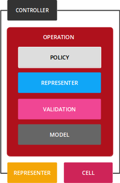

# Přehled Operace (Operation)

[Trailblazer](general-cs.md)



Operace je objekt služby.

Její cíl je jednoduchý: **Odstranit veškerou obchodní logiku z řadiče a modelu a poskytnout pro ni samostatný, zjednodušený objekt.**

Operace implementují funkce vaší aplikace, jako je vytváření komentářů, sledování uživatelů nebo exportování dokumentů PDF. Někdy se také nazývají *příkazy*.

Technicky vzato, operace zahrnuje a koordinuje veškerou obchodní logiku mezi dispečinkem řadiče a vrstvou perzistence. To zahrnuje úkoly, jako je vyhledání nebo vytvoření modelu, ověření příchozích dat pomocí objektu formuláře, trvalé uložení stavu aplikace pomocí modelu (modelů) a odeslání zpětných volání pro následné zpracování nebo dokonce vnořených operací.

Upozorňujeme, že operace není monolitický božský objekt, ale složení mnoha zúčastněných stran. Je na vás, abyste koordinovali funkce, jako jsou zásady, ověřování nebo zpětná volání.

Translated with DeepL.com (free version)

## Jak to vypadá

Operace jsou obvykle vyvolávány přímo z akce kontroléru. Koordinují veškerou doménovou logiku nezbytnou k provedení funkce aplikace.

```ruby
result = Song::Create.({ title: "SVT" })
```

Existuje pouze jeden způsob, jak spustit operaci: pomocí `Operation.call`. To lze také zapsat jako `Operation.()`.

Absence názvu metody je záměrná: tento objekt dělá pouze jednu věc, a proto **to, co dělá, se odráží v názvu třídy**.

```ruby
result = Song::Create.(
  params,
  "current_user" => Warden.get_user
)
```
V tomto volání musíte předat všechny runtime data operaci. `params`, aktuální uživatel, cokoli.

Implementace je třída.

```ruby
class Song::Create < Trailblazer::Operation
  extend Contract::DSL

  contract do
    property :title
    validates :title, presence: true
  end

  step     Model( Song, :new )
  step     :assign_current_user!
  step     Contract::Build()
  step     Contract::Validate( )
  failure  :log_error!
  step     Contract::Persist(  )

  def log_error!(options)
    # ..
  end

  def assign_current_user!(options)
    options["model"].created_by =
      options["current_user"]
  end
end
```

Řízení toku operace zajišťuje dvoucestná trubka. To vám pomůže vypořádat se s chybami, aniž byste museli kód zaplňovat příkazy `if` a `rescue`. Do tohoto pracovního postupu můžete přidat vlastní kroky a používat vestavěná makra Trailblazeru.

## Flow Control


Operace má dvoucestný tok nazývaný potrubí. Na pravé straně přidáte *kroky* pro úspěšný průběh, za předpokladu, že nedojde k žádným chybám, pomocí `step`. Budou provedeny v pořadí, v jakém je přidáte.

Na levé straně přidáte kroky pro zpracování chyb pomocí `failure`. Fungují přesně stejně jako na pravé straně, ale nebudou provedeny, dokud se neodchýlíte od správného průběhu.

```ruby

  step     Model( Song, :new )
  step     :assign_current_user!
  step     Contract::Build()
  step     Contract::Validate( )
  failure  :log_error!
  step     Contract::Persist(  )
```

Kroky se odchýlí do levé stopy, pokud je jejich návratová hodnota nepravdivá.

## Makra

Trailblazer obsahuje sadu užitečných makra pro potrubí, která vám poskytují předdefinovanou logiku kroků pro implementaci nejběžnějších úkolů.


`Nested`, `Wrap` a `Rescue` pomáhají vnořovat operace nebo zabalit části potrubí do příkazu `rescue`, transakce atd.


`Contract::Build`, `Validate` a `Persist` pomáhají pracovat se schématy Dry nebo smlouvami Reform, aby ověřily vstupní data a odeslaly správná data do modelů.


`Guard` a `Policy::Pundit` jsou ideálními kroky k ochraně operací (nebo jejich částí) před neoprávněným spuštěním.

Makra jsou snadno rozšiřitelná a můžete si napsat vlastní makra pro celou aplikaci.

## Stav a výsledek

Každý krok operace může zapisovat do objektu `options`, který je předáván z kroku na krok a nakonec bude součástí výsledku volání operace.

```ruby
class Song::Update < Trailblazer::Operation
  step :find_model!
  step :assign_current_user!

  def find_model!(options, params:, **)
    options["model"] = Song.find_by(id: params[:id])
  end

  def assign_current_user!(options, current_user:, **)
    options["model"].created_by = current_user
  end
end
```

Udržování pouze jednoho objektu se stavem umožňuje používat jako kroky také volatelné objekty a lambda výrazy.

```ruby
class Song::Update < Trailblazer::Operation
  step MyCallable
  step ->(options, params:, **) { ... }
```

Po spuštění je výsledkem tento objekt.

```ruby
result = Song::Update.(id: 1, ..)

result.success? #=> true
result["model"] #=> #<Song ..>
```

## Testování
Jelikož operace zahrnují celý pracovní postup pro funkci aplikace, můžete napsat jednoduché a rychlé jednotkové testy, abyste ověřili správné chování.

```ruby
describe Song::Create do
  it "prohibits empty params" do
    result = Song::Create.({})

    expect(result).to be_failure
    expect(result["model"]).to be_new
  end
end
```

Všechny okrajové případy a chyby lze otestovat pomocí jednotkových testů. Pomalé a neefektivní integrační testy jsou omezeny na minimum.

Operace mohou také nahradit továrny.

```ruby
describe Song::Create do
  let(:song) { Song::Create.(params) }
```

Tím zajistíte, že stav testování vaší aplikace bude vždy v souladu s tím, co se děje v produkčním prostředí. Už nikdy se nebudete potýkat s rozdíly mezi *stavem ve výrobě a stavem v produkci*.

Podívejte se na naši integraci matcheru [Rspec gem pro TRB](https://github.com/trailblazer/rspec-trailblazer). Matchery pro Minitest jsou také na cestě!

## Další informace
Kombinace dokumentace a průvodců vám pomůže rychle pochopit fungování a způsob použití k vyčištění stávajících kódových základen nebo spuštění nové aplikace.

Přečtěte si [→API DOCS](https://trailblazer.to/2.0/gems/operation/2.0/api), kde se dozvíte o implementacích potrubí a kroků a o makrech, které Trailblazer poskytuje.

Věnujte několik hodin čtení průvodce [→ZAČÍNÁME](http://trailblazer.to/guides/trailblazer/2.0/01-operation-basics.html).

Poté budete připraveni pracovat s Trailblazer 2.

from: [here](https://trailblazer.to/2.0/gems/operation/2.0/)

* [Guide - 03- Rails Basics](https://trailblazer.to/2.0/guides/trailblazer/2.0/03-rails-basics)

* [Operation API](https://trailblazer.to/2.0/gems/operation/2.0/api)
* [Trailblazer Loader](https://trailblazer.to/2.0/gems/trailblazer/loader)
* [Trailblazer Test](https://trailblazer.to/2.0/gems/trailblazer/2.0/test)
* [Trailblazer::Rails](https://trailblazer.to/2.0/gems/trailblazer/2.0/rails)
* [Cells](https://trailblazer.to/2.0/gems/cells)
* [Cells: Getting Started](https://trailblazer.to/2.0/gems/cells/getting-started)
* [Cells Render API](https://trailblazer.to/2.0/gems/cells/render)
* [Representable](Representable)
