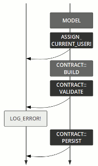

# Operation Overview

[Trailblazer](general-en.md)


An operation is a service object.

Its goal is simple: **Remove all business logic from the controller and model and provide a separate, streamlined object for it.**

Operations implement functions of your application, like creating a comment, following a user or exporting a PDF document. Sometimes this is also called *command*.

Technically, an operation embraces and orchestrates all business logic between the controller dispatch and the persistence layer. This ranges from tasks as finding or creating a model, validating incoming data using a form object to persisting application state using model(s) and dispatching post-processing callbacks or even nested operations.

Note that an operation is not a monolithic god object, but a composition of many stakeholders. It is up to you to orchestrate features like policies, validations or callbacks.

## What It Looks Like

Operations are usually invoked straight from the controller action. They orchestrate all domain logic necessary to perform the app's function.

```ruby
result = Song::Create.({ title: "SVT" })
```

There is only one way to run an operation: using `Operation.call`. This can also be written as `Operation.()`.

The absence of a method name here is by design: this object does only one thing, and hence **what it does is reflected in the class name**.

```ruby
result = Song::Create.(
  params,
  "current_user" => Warden.get_user
)
```
You have to pass all runtime data to the operation in this call. `params`, current user, you name it.

The implementation is a class.

```ruby
class Song::Create < Trailblazer::Operation
  extend Contract::DSL

  contract do
    property :title
    validates :title, presence: true
  end

  step     Model( Song, :new )
  step     :assign_current_user!
  step     Contract::Build()
  step     Contract::Validate( )
  failure  :log_error!
  step     Contract::Persist(  )

  def log_error!(options)
    # ..
  end

  def assign_current_user!(options)
    options["model"].created_by =
      options["current_user"]
  end
end
```

The operation’s control flow is handled by a two-tracked pipe. This helps you deal with errors without littering your code with `if`s and `rescue`s. You can add your own, custom steps to that workflow and use Trailblazer’s built-in macros.

## Flow Control



An operation has a two-tracked flow called a pipe. On the right track you add *steps* for the happy path, assuming no errors happen using `step`. They will executed in the order you add them.

On the left track, you add error handler steps using `failure`. They work exactly like the right track, but won't be executed until you deviate from the right track.

```ruby

  step     Model( Song, :new )
  step     :assign_current_user!
  step     Contract::Build()
  step     Contract::Validate( )
  failure  :log_error!
  step     Contract::Persist(  )
```

Steps will deviate to the left track if their return value is falsey.

## Macros

Trailblazer comes with a set of helpful pipe macros that give you predefined step logic to implement the most common tasks.


`Nested`, `Wrap` and `Rescue` help to nest operations, or wrap parts of the pipe in a `rescue` statement, a transaction, etc.


`Contract::Build`, `Validate` and `Persist` help dealing with Dry schemas or Reform contracts to validate input, and push sane data to models.


`Guard` and `Policy::Pundit` are ideal steps to protect operations (or parts of it) from being run unauthorized.

Macros are easily extendable and you can write your own application-wide macros.

## State and Result

Each step in the operation can write to the `options` object that is passed from step to step, and in the end will be in the result of the operation call.

```ruby
class Song::Update < Trailblazer::Operation
  step :find_model!
  step :assign_current_user!

  def find_model!(options, params:, **)
    options["model"] = Song.find_by(id: params[:id])
  end

  def assign_current_user!(options, current_user:, **)
    options["model"].created_by = current_user
  end
end
```

Maintaining one stateful object, only, allows using callable objects and lambdas as steps as well.

```ruby
class Song::Update < Trailblazer::Operation
  step MyCallable
  step ->(options, params:, **) { ... }
```

After running, this object is the result.

```ruby
result = Song::Update.(id: 1, ..)

result.success? #=> true
result["model"] #=> #<Song ..>
```

## Testing
Since operations embrace the entire workflow for an application’s function, you can write simple and fast unit-tests to assert the correct behavior.

```ruby
describe Song::Create do
  it "prohibits empty params" do
    result = Song::Create.({})

    expect(result).to be_failure
    expect(result["model"]).to be_new
  end
end
```

All edge-cases and bugs can be tested via unit tests. Slow, inefficient integration tests are reduced to a minimum.

Operations can also replace factories.

```ruby
describe Song::Create do
  let(:song) { Song::Create.(params) }
```

This will make sure your application test state is always inline with what happens in production. You won’t have an always diverging *factory vs. production state* ever again.

Check out our [Rspec gem for TRB](https://github.com/trailblazer/rspec-trailblazer) matcher integration. Matchers for Minitest are coming, too!

## Learn More
A mix of documentation and guides will help you to understand the operation quickly and how to use it to clean up existing codebases or start a new app.

Read the [→API DOCS](https://trailblazer.to/2.0/gems/operation/2.0/api) to learn about the pipe and step implementations and what macros Trailblazer provides for you.

Make sure to spend some hours reading the [→GETTING STARTED](http://trailblazer.to/guides/trailblazer/2.0/01-operation-basics.html) guide.

You will be ready to work with Trailblazer 2.

from: [here](https://trailblazer.to/2.0/gems/operation/2.0/)

* [Guide - 03- Rails Basics](https://trailblazer.to/2.0/guides/trailblazer/2.0/03-rails-basics)

* [Operation API](https://trailblazer.to/2.0/gems/operation/2.0/api)
* [Trailblazer Loader](https://trailblazer.to/2.0/gems/trailblazer/loader)
* [Trailblazer Test](https://trailblazer.to/2.0/gems/trailblazer/2.0/test)
* [Trailblazer::Rails](https://trailblazer.to/2.0/gems/trailblazer/2.0/rails)
* [Cells](https://trailblazer.to/2.0/gems/cells)
* [Cells: Getting Started](https://trailblazer.to/2.0/gems/cells/getting-started)
* [Cells Render API](https://trailblazer.to/2.0/gems/cells/render)
* [Representable](Representable)
